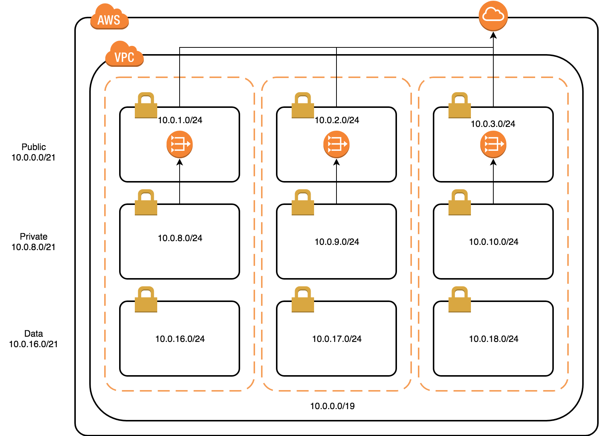

# Cloudformation VPC Starter Template

There are a lot of templates to create a VPC in AWS. None of them exactly meet the requirements we have. Most of the frustration was due to the following 2 things:

* Cloudformation Templates are huge, and contain a lot of conditions which makes it hard to read, maintain or extend.
* You have to do all the subnet calculation manually. And because a Subnet cannot span AZs, you have to virtually think of "layers" before calculating the Subnets.

This repository contains Templates which can be used immediately (solving the second frustration). It also contains a Jinja2 Template. Updating this Jinja2 Template is easy to read, maintain and extend, and there is less to no code duplication.

## Architecture

A picture is worth a thousand words (even in Yaml). This diagram shows the default setup and default Cidr Block.



## Assumptions (a.k.a. Requirements)

* You only specify the VPC Cidr block, all other Cidr Blocks are generated based on the VPC Cidr Block. This is different from many other templates, where you have to calculate and specify the Cidr Blocks for each Subnet.
* Based on the number of AZs to span (a, b, c, etc) and the number of desired layers (public, private, data), the optimal density is chosen by the script. You can force this to reserve future expansion for more AZs or more layers. (`layer_netmask: 20` and `subnet_netmask: 24`)
* You specify the Availability Zones (AZs) to deploy subnets in. Some regions have just 2 AZs, others have 3 or 5. You could generate a starter template for any region. In the examples a mix is available. Remember, a Subnet cannot span multiple AZs.
* The stack always creates a public subnet including an internet gateway. You should never remove the public subnet when using this starter template. If your use case does not allow to deploy a public subnet, find another starter template.
* Optionally a private subnet can be deployed, in that case in each AZ a NAT GW is deployed.
* Optionally a third subnet can be deployed, for example "data". This subnet has no internet connection which is a best practice for RDS. These Data Subnets can be marked as RDS Data Subnets.
* Avoid Duplicate Code. Default cloudformation has a lot of duplicate code. Which means if you need to add a tag to all subnets, you have to add it 9 times. Using the jinja2 template, it's just one.
* The generated template is valid YAML, and should work natively with any other tool. In other words, you could update the jinja2 template, generate the template just once and use the result and forget this generator. There are also tools like Ansible and Sceptre which support Jinja2 templates. (I'll test these tools some time, and update accordingly.)

## Limitations

* More than one public, private or data layer is not possible.

## Defaults

In the data folder of the repository, you'll find configurations. The template below is the default.yml. If you don't select a data file, these defaults are used.

```
---
vpc_cidr_block: "10.0.0.0/19"
layers:
  - public
  - private
  - data
azs:
  - a
  - b
  - c
```

* **vpc_cidr_block**. See this as the "Default VPC". For any other VPC, production or just a sandbox, you should pick your own Cidr Block. There are thousands of them available, as long as you use /19. If you increase this number, remember to increase the max_subnet_netmask accordingly. If you decrease this number, you could set the max_subnet_netmask to a lower number as well, giving you more available IP addresses per Subnet.
* **layers**. To deploy workloads to AWS, public, private and data are quite common "layers". I don't think this will change very often, so consider this the default. Some organisations deploy multiple stacks in one VPC and each stack has it's own Subnet(s). For this use case, you cannot use this template.
* **azs**. Almost all Regions have 3 AZs. Some have 2, in that case remove the 'c'. Some have '5', but keep in mind you have to design for costs. With sufficient workloads, small instances and least desired down time, 5 is often cheaper than 3.

### Custom reservations

When creating a /16 vpc with just 2 layers and 2 azs, will result in very large subnets. By adding the following rules, a reservation is made for future changes. If you later change the layers from 2 to 3 and azs to 3 or even 5, this can easily be updated.

```
layer_netmask: 20
subnet_netmask: 24
```

## Examples

I've created a couple of common setups.

|VPC Cidr|AZs|Layers|Filename|Estimate Montly Pricing*|
|---|---|---|---|---|
|/20|3|public,private,data|small.yml|70|
|/16|3|public,private,data|large.yml|105|
|/19|1|public|public-1az.yml|0|
|/19|3|public|public-3az.yml|0|
|/19|1|public,private,data|layered-1az.yml|35|
|/19|3|public,private,data|layered-3az.yml|105|
|/19|5|public,private,data|layered-5az.yml|175|

To generate a Cloudformation Template:

```
pip install jinja2
jinja2 vpc.yml.j2 data/small.yml --format=yaml > templates/small.yml
```

\* Most resources in the templates are free of charge. The only component which is quite expensive, is the NAT gateway.

This template contains one VPC, an Internet Gateway, a generic Route Table for Public and Data Subnets. For each Private Subnet an Elastic IP (EIP) and NAT gateway is deployed, and each Private Subnet has a RouteTable with a route to the NAT gateway.

Other Resources like VPC Peering, or Bastion Hosts or anything else, must be added with another Cloudformation Template. To add another layer of defence, you could consider to add Network ACLs to this template.

## Deploy

After generating a template, you can easily deploy a VPC with the following command:

```
aws cloudformation create-stack \
  --stack-name startervpc \
  --template-body file://templates/default.yml \
  --parameters ParameterKey=cidrBlockVpc,ParameterValue=10.20.30.0/19
```

## Finished?

No. This vpc template is written in just one day. It's not fully tested and it requires some refactoring. It will be improved over time. If you have feedback, please let me know.

## Happy?

Yes! I was about to deploy a couple of VPCs, and struggling with the Cidr blocks. It took me as much work as usual, but now it will save me a lot of time in next exercises.